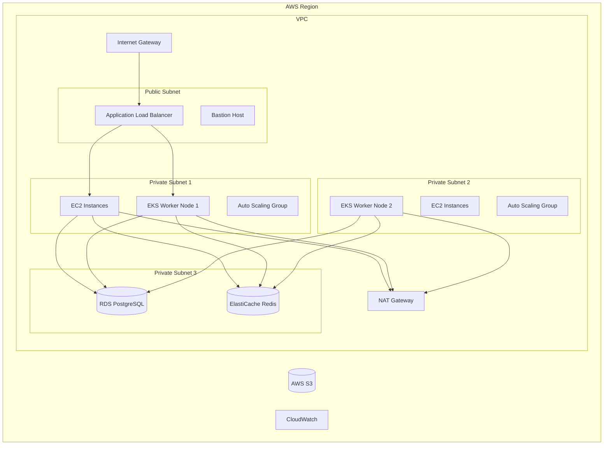
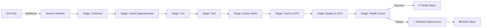
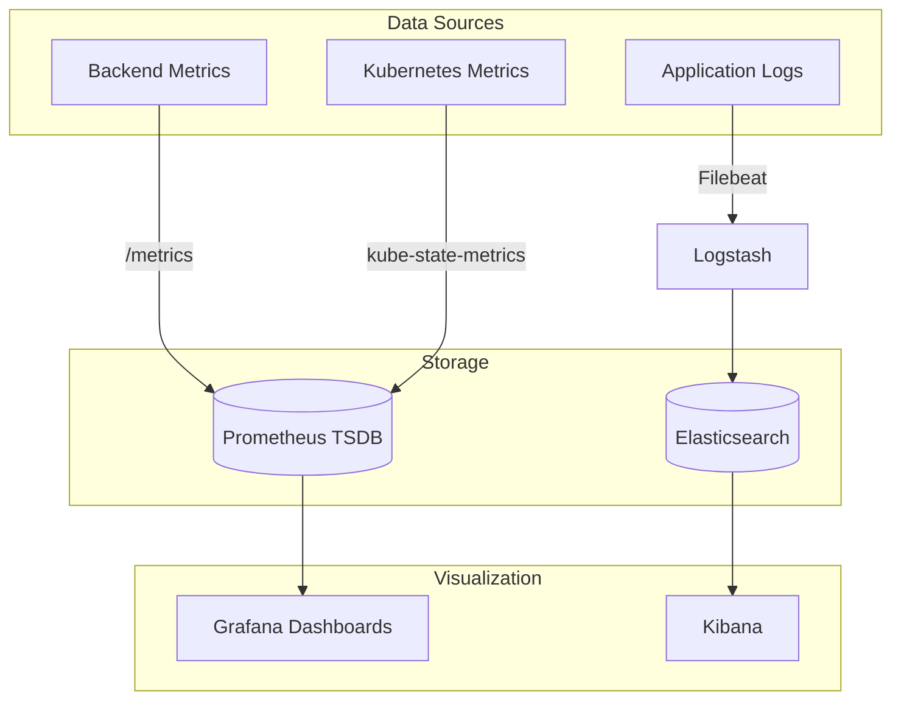
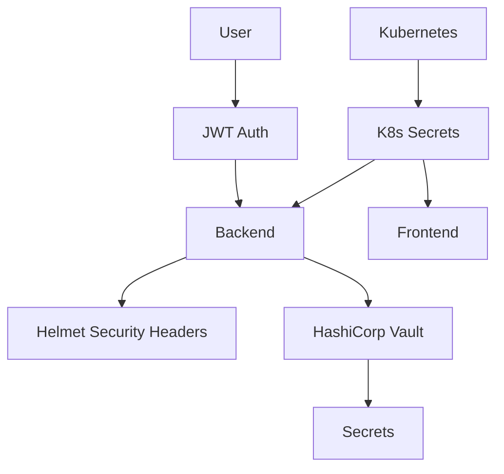
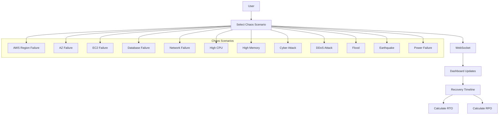

# 🌐 OmniVerse Nexus - System Architecture

**Project Name**: OmniVerse Nexus  
**Course**: B.Tech Computer Science (DevOps)  
**Semester**: 4  
**Author**: [Your Name Here]  

---

## 📋 Table of Contents
1. [System Overview](#1-system-overview)
2. [High-Level Architecture Diagram](#2-high-level-architecture-diagram)
3. [Infrastructure Layer (AWS)](#3-infrastructure-layer-aws)
4. [Containerization & Orchestration](#4-containerization--orchestration)
5. [CI/CD Pipeline (Jenkins)](#5-cicd-pipeline-jenkins)
6. [Monitoring & Observability](#6-monitoring--observability)
7. [Security & Secrets Management](#7-security--secrets-management)
8. [Disaster Recovery & Chaos Engineering](#8-disaster-recovery--chaos-engineering)

---

## 1. System Overview
OmniVerse Nexus is a **cloud-native, enterprise-grade Digital Twin Platform** with:
- Real-time simulation and data visualization
- Chaos engineering and disaster recovery testing
- Auto-scalable infrastructure
- Full CI/CD automation
- Comprehensive monitoring (Prometheus + Grafana)
- Centralized logging (ELK Stack)
- Zero-downtime deployments (Rolling, Canary, Blue-Green)

---

## 2. High-Level Architecture Diagram
```mermaid
graph TB
    subgraph Client Layer
        User[End User]
        Admin[Admin / DevOps]
    end

    subgraph Application Layer
        Frontend[React Frontend (Vite)]
        Backend[Node.js Backend (Express)]
        SimEngine[Chaos Simulation Engine]
        WS[WebSocket Server]
    end

    subgraph Data Layer
        Postgres[(PostgreSQL)]
        Redis[(Redis Cache)]
    end

    subgraph Infrastructure Layer
        ALB[AWS ALB]
        ASG[EC2 Auto Scaling Group]
        EKS[AWS EKS (Kubernetes)]
        S3[(AWS S3)]
    end

    subgraph Observability Layer
        Prometheus[Prometheus]
        Grafana[Grafana]
        ELK[ELK Stack]
    end

    subgraph CI_CD Layer
        Git[Git Repository]
        Jenkins[Jenkins CI/CD]
        ECR[(AWS ECR)]
    end

    User --> Frontend
    Admin --> Jenkins
    Frontend --> Backend
    Frontend --> WS
    Backend --> SimEngine
    SimEngine --> WS
    Backend --> Postgres
    Backend --> Redis
    ALB --> ASG
    ASG --> Frontend
    ASG --> Backend
    EKS --> Frontend
    EKS --> Backend
    Prometheus --> Backend
    Prometheus --> EKS
    Grafana --> Prometheus
    ELK --> Backend
    ELK --> EKS
    Jenkins --> Git
    Jenkins --> ECR
    Jenkins --> EKS
```

---

## 3. Infrastructure Layer (AWS)

---

## 4. Containerization & Orchestration
```mermaid
graph TB
    subgraph Kubernetes (EKS) Cluster
        NS[Namespace: omniverse]
        
        subgraph Workloads
            FE[Frontend Deployment]
            BE[Backend Deployment]
            HPA[HPA (Horizontal Pod Autoscaler)]
            Canary[Canary Deployment]
            BlueGreen[Blue-Green Deployment]
        end
        
        subgraph Networking
            SvcFE[Frontend Service]
            SvcBE[Backend Service]
            Ingress[Ingress Controller]
        end
        
        subgraph Config
            ConfigMap[ConfigMap]
            Secrets[Kubernetes Secrets]
            PV[Persistent Volume]
            PVC[Persistent Volume Claim]
        end
    end

    Ingress --> SvcFE
    Ingress --> SvcBE
    SvcFE --> FE
    SvcBE --> BE
    HPA --> FE
    HPA --> BE
    FE --> ConfigMap
    FE --> Secrets
    FE --> PVC
    BE --> ConfigMap
    BE --> Secrets
    BE --> PVC
```

---

## 5. CI/CD Pipeline (Jenkins)


---

## 6. Monitoring & Observability


---

## 7. Security & Secrets Management


---

## 8. Disaster Recovery & Chaos Engineering


---

## 📦 Technology Stack Summary
| Layer | Technologies |
|-------|--------------|
| Frontend | React 19, Vite, Tailwind CSS, Framer Motion, Recharts, Socket.IO Client |
| Backend | Node.js, Express.js, Prisma ORM, Socket.IO, Winston, Prom Client |
| Infrastructure | Terraform, AWS (VPC, ALB, ASG, EKS, RDS, ElastiCache, S3, CloudWatch) |
| Containerization | Docker, Docker Compose |
| Orchestration | Kubernetes (EKS) |
| CI/CD | Jenkins |
| Monitoring | Prometheus, Grafana |
| Logging | ELK Stack (Elasticsearch, Logstash, Kibana) |
| Security | JWT, Helmet, Kubernetes Secrets, HashiCorp Vault (Integration) |
