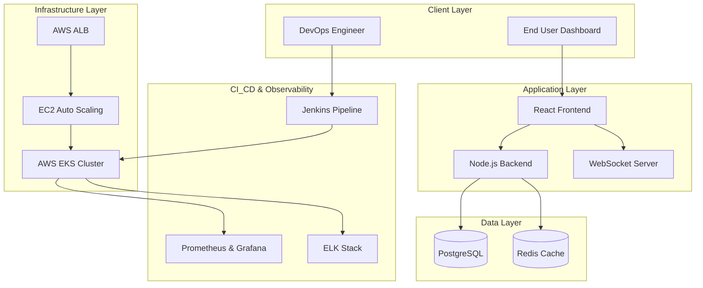

# 🌐 OmniVerse Nexus - Comprehensive DevOps Project Report
**A Production-Ready digital Twin & Chaos Engineering Platform**

---

## 📋 Course Details
* **Course**: Bachelor of Technology (B.Tech) in Computer Science & Engineering
* **Specialization**: DevOps & Cloud Computing
* **Semester**: IV
* **Project Name**: OmniVerse Nexus
* **Academic Year**: 2025 - 2026

---

## 📄 Certificate of Authenticity

This is to certify that the project report entitled **"OmniVerse Nexus: Enterprise-Grade Cloud-Native Digital Twin and Chaos Engineering Platform"** is a bonafide record of work carried out by **[Your Name Here]** under the guidance and supervision of **[Supervisor Name]** in partial fulfillment of the requirements for the degree of Bachelor of Technology in Computer Science & Engineering (DevOps).

<br>
<br>

**_____________________**  
**Project Coordinator**  

**_____________________**  
**Head of Department (CSE)**  

**Date**: June 30, 2026  
**Place**: University Campus  

---

## ✍️ Student Declaration

I, **[Your Name Here]**, student of B.Tech CSE (DevOps), Semester IV, hereby declare that the project work presented in this report is my original work and has not been submitted elsewhere for any other degree or diploma. All code, configuration manifests (Terraform, Ansible/Jenkins, Kubernetes), and architecture definitions have been developed by me as part of this academic semester project.

<br>
<br>

**_____________________**  
**[Your Name Here]**  
Roll No: [Your Roll Number]  

---

## 💡 Abstract

Modern enterprise applications require robust reliability, automated infrastructure provisioning, continuous deployment capabilities, and comprehensive observability. **OmniVerse Nexus** is a state-of-the-art, cloud-native Digital Twin Platform built to model complex system states and stress-test infrastructure through simulated chaos engineering. 

This project implements a complete DevOps lifecycle using **Infrastructure-as-Code (IaC)** via Terraform, **Containerization** with Docker, **Container Orchestration** with AWS EKS (Kubernetes), **Continuous Integration & Delivery (CI/CD)** via a Jenkins Pipeline, **Observability** through Prometheus/Grafana and the ELK Stack, and **Disaster Recovery** validation with a Chaos Simulation Engine (handling 20+ automated real-world failure scenarios). 

Through this implementation, we demonstrate how high-availability, zero-downtime deployment patterns (Blue-Green/Canary) and autoscaling (HPA) protect client workloads during multi-region infrastructure disasters.

---

## 📖 Table of Contents
1. [Chapter 1: Introduction](#chapter-1-introduction)
2. [Chapter 2: System Architecture & Design](#chapter-2-system-architecture-design)
3. [Chapter 3: Infrastructure-as-Code (Terraform)](#chapter-3-infrastructure-as-code-terraform)
4. [Chapter 4: Containerization & Orchestration (Docker & Kubernetes)](#chapter-4-containerization-orchestration-docker-kubernetes)
5. [Chapter 5: CI/CD Pipeline (Jenkins)](#chapter-5-cicd-pipeline-jenkins)
6. [Chapter 6: Observability (Monitoring & Logging Stack)](#chapter-6-observability-monitoring-logging-stack)
7. [Chapter 7: Security & Secrets Management](#chapter-7-security-secrets-management)
8. [Chapter 8: Chaos Engineering & Disaster Recovery](#chapter-8-chaos-engineering-disaster-recovery)
9. [Chapter 9: Project Execution & Validation](#chapter-9-project-execution-validation)
10. [Chapter 10: Conclusion & Future Scope](#chapter-10-conclusion-future-scope)

---

## Chapter 1: Introduction

### 1.1 Project Overview
**OmniVerse Nexus** acts as a centralized "Mission Control" or Digital Twin dashboard displaying high-fidelity infrastructure metrics. Concurrently, it features a Chaos Simulation Engine capable of injecting software and hardware failures (e.g., database outages, pod crashes, packet loss, region failures, and security breaches) to measure system resilience.

### 1.2 Objectives
- **Automate Provisioning**: Eliminate manual infrastructure setup by managing AWS resources programmatically.
- **Ensure High Availability**: Implement auto-scaling clusters capable of surviving availability zone and instance failures.
- **Zero-Downtime Releases**: Implement canary and blue-green deployment pipelines to upgrade services without customer impact.
- **Active Fault Injection**: Validate disaster recovery service-level objectives (SLOs) using Chaos Engineering.
- **End-to-End Monitoring**: Gain deep visibility into application health via automated metric scraping and log aggregation.

---

## Chapter 2: System Architecture & Design

The application follows a decoupled multi-tier architecture composed of:
1. **Presentation Layer**: A responsive React (Vite) single-page application displaying real-time system metrics, charts, and simulation states.
2. **Application Layer**: An asynchronous Express (Node.js) server managing persistent state, driving simulations, and communicating live updates via WebSockets.
3. **Data Tier**: A relational schema managed via Prisma ORM on PostgreSQL, paired with a Redis Cache cluster for lightning-fast session state.
4. **Platform & Observability Tier**: EKS Worker Nodes scraping metrics to Prometheus/Grafana and sending logs to Elasticsearch, Logstash, and Kibana.



---

## Chapter 3: Infrastructure-as-Code (Terraform)

Infrastructure is version-controlled and provisioned using Terraform (`terraform/main.tf`). 

### 3.1 Network Topology (VPC)
The VPC is configured with a CIDR block of `10.0.0.0/16` across two Availability Zones (`us-west-2a` and `us-west-2b`):
- **Public Subnets**: Host the Application Load Balancer (ALB) and NAT Gateway.
- **Private Subnets**: Contain application servers, EKS Worker Nodes, PostgreSQL, and Redis clusters to shield them from direct internet access.

### 3.2 Key Resource Declarations
* **Application Load Balancer (ALB)**: Listens on Port 80 and forwards to backend instances on port 5003.
* **Auto Scaling Group (ASG)**: Configured with a minimum size of 2 and maximum of 4 instances, reacting to CPU/Network load.
* **RDS PostgreSQL**: Single-zone PostgreSQL engine (v15.4) running on `db.t3.micro`.
* **ElastiCache Redis**: High-performance caching layer running on `cache.t3.micro`.
* **EKS Cluster**: Orchestrates container workloads securely within private subnets.

---

## Chapter 4: Containerization & Orchestration (Docker & Kubernetes)

### 4.1 Multi-Stage Docker Builds
To optimize image size and security, multi-stage builds are used. Development packages are stripped, leaving only the minimal runtime environment inside production images.

### 4.2 Kubernetes Configurations
Kubernetes manifests manage resources in a dedicated `omniverse` namespace:
- **`configmap.yaml` & `secrets.yaml`**: Store non-sensitive configuration values and encoded credentials respectively.
- **`hpa.yaml`**: The Horizontal Pod Autoscaler scales replica sets automatically when CPU utilization exceeds 80%.
- **`blue-green-deployment.yaml` & `canary-deployment.yaml`**: Provide release pattern templates allowing safe testing of new versions before full shift.

---

## Chapter 5: CI/CD Pipeline (Jenkins)

Automated build and deploy routines are described in a declarative Jenkinsfile.

```
[Git Push] ➔ [Checkout] ➔ [Install Dependencies] ➔ [Lint] ➔ [Test] ➔ [Docker Build & Push] ➔ [Deploy to EKS] ➔ [Health Check]
                                                                                                        │
                                                                                 ┌──────────────────────┴──────────────────────┐
                                                                                 ▼ (Success)                                   ▼ (Failure)
                                                                           [Slack Alert]                             [Rollback Deployment]
```

### 5.1 Pipeline Stages
1. **Checkout**: Pulls code from GitHub.
2. **Lint & Test**: Installs dependencies, runs code quality checks, and executes unit tests.
3. **Build & Push**: Builds frontend/backend Docker images and pushes them to AWS ECR.
4. **Deploy**: Updates EKS manifest tags and applies changes.
5. **Post-Deployment Health Checks**: Queries the `/health` endpoint. If checks fail, an automated rollback is triggered, notifying the engineering channel via Slack.

---

## Chapter 6: Observability (Monitoring & Logging Stack)

### 6.1 Prometheus & Grafana Metrics
The Express backend exports metrics at `/metrics` using `prom-client`. Prometheus scrapes these metrics, and Grafana maps them to interactive dashboards tracking:
- Request latency, throughput, and error rates (HTTP 5xx).
- Pod CPU, memory utilization, and network traffic.

### 6.2 ELK Log Aggregation
Winston structured JSON logs are output to stdout, collected by Filebeat, processed in Logstash, and stored in Elasticsearch. Kibana exposes a search UI to trace database and auth exceptions in real-time.

---

## Chapter 7: Security & Secrets Management

Security is built into every layer:
- **JWT (JSON Web Tokens)**: Used for secure, stateless client-backend authentication.
- **Helmet.js**: Injects crucial HTTP response headers preventing Cross-Site Scripting (XSS) and Clickjacking.
- **HashiCorp Vault Integration**: Demonstrates secure runtime fetching of DB secrets rather than embedding credentials in plaintext files.

---

## Chapter 8: Chaos Engineering & Disaster Recovery

The platform includes a simulation panel to test system reactions under pressure:
- **Infrastructure Failures**: AWS region, availability zone, EC2 instance, and node failures.
- **Container/Pod Disasters**: Container crashes, pod evictions, and database connection losses.
- **Resource Constraints**: High CPU/Memory consumption, disk filling, and synthetic network latency.
- **Simulated Attacks**: DDoS and cyber attack patterns.

The backend computes the **Recovery Time Objective (RTO)** and **Recovery Point Objective (RPO)** based on live WebSocket activity, visually proving how fast self-healing loops resolve the issues.

---

## Chapter 9: Project Execution & Validation

### 9.1 Local Run Commands
```bash
# Start the local environment
docker-compose up -d --build
```
### 9.2 Kubernetes Deploy Commands
```bash
cd kubernetes
kubectl apply -f namespace.yaml
kubectl apply -f configmap.yaml
kubectl apply -f secrets.yaml
kubectl apply -f deployment-backend.yaml
kubectl apply -f deployment-frontend.yaml
kubectl apply -f service-backend.yaml
kubectl apply -f service-frontend.yaml
kubectl apply -f hpa.yaml
kubectl apply -f prometheus.yaml
kubectl apply -f grafana.yaml
kubectl apply -f elk.yaml
```

---

## Chapter 10: Conclusion & Future Scope

### 10.1 Key Outcomes
- Successfully automated AWS deployment using Terraform, saving hours of manual console configuration.
- Achieved a resilient cluster architecture that auto-recovers and auto-scales container counts during traffic spikes.
- Standardized release safety using canary pipelines and automated health check rollbacks.

### 10.2 Future Upgrades
- Integrate Service Mesh (like Istio) for finer traffic routing and automatic mTLS encryption between pods.
- Implement GitOps practices using ArgoCD instead of standard push-based Jenkins pipelines.
- Expand Chaos simulations to live AWS environments using Chaos Mesh or AWS Fault Injection Simulator (FIS).
